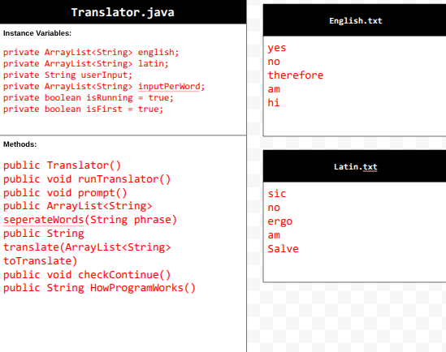

# Unit 6 - Natural Language Processing Project

## Introduction

Natural language processing (NLP) is used in many apps and devices to interact with users and make meaning of text to determine how to respond, find information, or to create new text. Your goal is to use natural language processing techniques to identify structure, patterns, and meaning in a text to have conversations with a user, execute commands, perform manipulations on the text, or generate new text.

## Requirements

Use your knowledge of object-oriented programming, ArrayLists, the String class, and algorithms to create a program that uses natural language processing techniques:

- **Create at least two ArrayLists** – Create at least two ArrayLists to store the data used in your program, such as data from text files or entered by the user.
- **Implement one or more algorithms** – Implement one or more algorithms that use loops and conditionals to find or manipulate elements in an ArrayList or String object.
- **Use methods in the String class** - Use one or more methods in the String class in your program, such as to divide text into sentences or phrases.
- **Use at least one natural language processing technique** – Use a natural language processing technique to process, analyze, and/or generate text.
- **Document your code** – Use comments to explain the purpose of the methods and code segments and note any preconditions and postconditions.

## UML Diagram

## Video

## Project Description

The programs goal is to take in a sentence of phrase from the user and translate it to latin. It does this by breaking apart the input by individual word, then iterating through the English words until in finds a match, then finds the translation in the Latin words. When the program is run, it will display a hello message and ask for a sentence or word to translate. Once an input is recived, the program will output the translation, and ask if the user whishes another one. If not, then it displays a thank you and a short description of how the program operates.

## NLP Techniques

The Natural Language Technique that I implemented was Translator. This technique takes in words and then translates them into another langugage. The methods that are used for this technique are seperateWords(String phrase) and translate(ArrayList<String> toTranslate). The seperateWords method is used to seperate the user input into seperate words, which can then be translated. It does this by finding where the spaces are with .indexOf(), then seperating out each of the words using .substring(). While the translate method takes in the ArrayList of each word and returns a String of the translations. It operates by for every word to translate, for every word in the English text file, if they are the same then add the Latin translation of that word to the String. If there is not a translation present, then add [Word not found instead]. These methods are used to process and analize the text using NLP.
